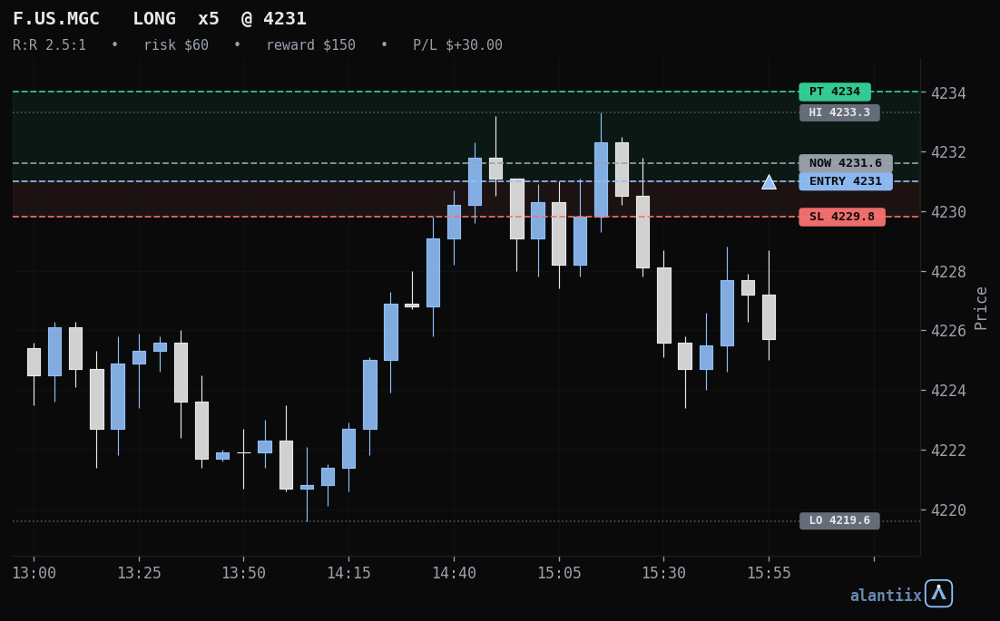
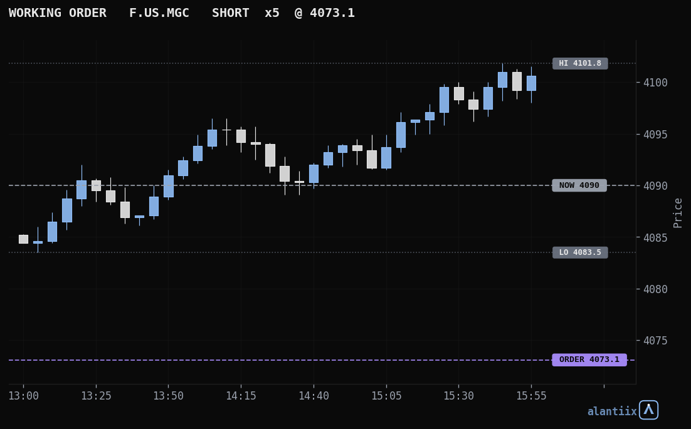
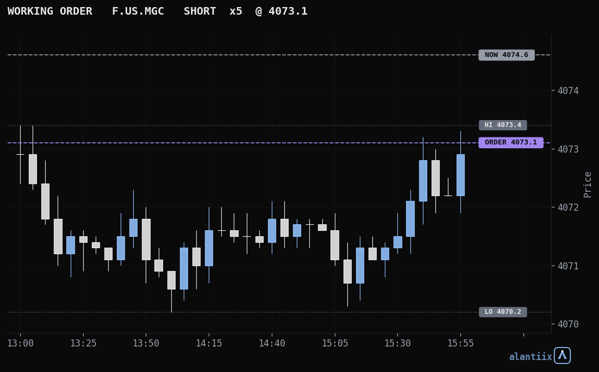
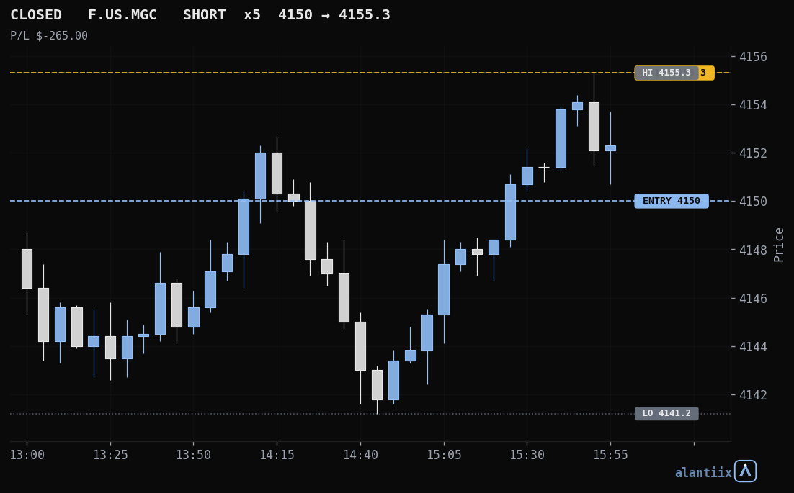
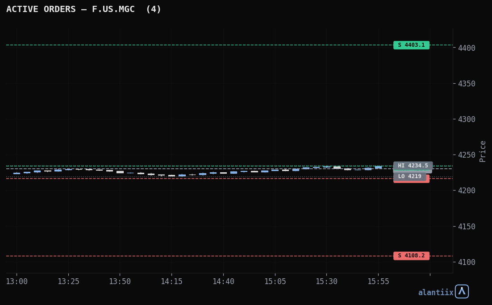

# ProjectX Discord Alerts

Real-time Discord alerts and annotated charts for futures trading on the
**ProjectX / TopstepX** API. Posts a styled alert at every stage of a trade's
life — when an order is **working**, when it **fills**, and when the position
**closes** — plus a pre-close snapshot/resubmit pair for overnight order
handling.

Charts are rendered server-side with matplotlib in a clean, TradingView-style
dark theme.

---

## ⚠️ Disclaimer

This software places and replays **live orders** via the ProjectX/TopstepX API
and is provided **as-is, with no warranty** (see LICENSE). Trading futures
carries substantial risk of loss. You are solely responsible for your account,
your orders, and verifying every value (point values, tick sizes, risk limits,
schedules) against your own broker/plan before relying on it. This project is
**not affiliated with, endorsed by, or supported by** TopstepX, Topstep, or
TradingView. Not financial advice.

The `resubmit` job **submits real orders**. Understand it fully before enabling.

---

## What you get

- **Order Working alert** — fires when a new resting order appears (limit/stop),
  with action, type, size, trigger price, current price, and distance in
  ticks/points. Also posts an *Active Orders* board and a chart per symbol.
- **Approaching-trigger alert** — warns when price comes within a configurable
  number of ticks of a working order's stop/limit. Fires once per approach and
  re-arms if price pulls away and comes back (no per-minute spam).
- **Order Filled alert** — a full trade ticket: entry, size, current price,
  take-profit / stop with distance, R:R, dollar risk→reward, live unrealized
  P/L (pts / $ / R), a progress bar between stop and target, optional account
  balance, optional **Topstep risk guardrails** (daily-loss + trailing-drawdown
  room with breach warnings), and an annotated chart.
- **Position Closed alert** — realized net P/L, points, fees, entry→exit,
  time-in-trade, win/loss color, and a closed-trade chart.
- **Pre-flatten snapshot + reopen resubmit** — captures open orders before the
  daily close and re-places them when the market reopens.
- **Charts** — candlesticks (3h / 5-min), labeled price levels, shaded
  risk/reward zones, session high/low, all in a dark TradingView-style theme.

Every alert is deduplicated via a small JSON state file, so you never get
repeats.

---

## Examples

Each alert posts a Discord embed with the data described below, plus an
annotated chart.

**Order filled** — entry, stop, target, R:R, live P/L, progress between stop and target:



**Order working** — a resting stop/limit with its trigger and distance to price:



**Approaching trigger** — price within your configured distance of an order:



**Position closed** — entry → exit with realized P/L:



**Active orders board** — all resting orders for a symbol on one chart:



> Tip: replace these with real screenshots of your own Discord alerts (drop
> them in `assets/` and update the paths) for the fullest picture.

---

## How it works

A single **monitor** script runs every minute and:

1. Authenticates to the ProjectX API (token cached in the state file).
2. Detects newly *filled* orders → fill alerts.
3. Detects newly *working* orders → working-order alerts + active-orders board.
4. Detects newly *closed* trades (via `Trade/search`) → exit alerts.
5. Logs a live snapshot of open positions and working orders to stdout.

Two scheduled scripts handle the daily close:

- **snapshot** (run a few minutes before the daily flatten) — saves all open
  orders to a shared JSON file.
- **resubmit** (run at reopen) — re-places the saved orders.

All three share one working directory so the snapshot→resubmit handoff and the
monitor's dedupe/peak-equity state persist across runs.

---

## Requirements

- A **ProjectX / TopstepX API key** (username + API key).
- A **Discord webhook** URL.
- **Docker** (recommended) or any Python 3.10+ environment with network access
  to the API and Discord.

Python deps (`requests`, plus `mplfinance` / `pandas` / `matplotlib` for charts)
auto-install on first use into the directory on `PYTHONPATH`; see
`requirements.txt` to install them yourself.

---

## Configuration

Secrets are read from environment variables — **nothing is hardcoded**. Copy
`.env.example` to `.env` and fill it in:

| Variable | Required | Description |
|---|---|---|
| `PROJECTX_USERNAME` | yes | Your ProjectX/TopstepX username |
| `PROJECTX_API_KEY` | yes | Your API key |
| `DISCORD_WEBHOOK` | yes | Discord webhook URL |
| `PROJECTX_API_BASE` | no | API base (default `https://api.topstepx.com/api`) |
| `PROJECTX_STATE_DIR` | no | Where state/snapshot files live (set to your mounted dir) |
| `PROJECTX_PROXIMITY_DOLLARS` | no | Warn when price is within $N (price units) of a working order's trigger (default `2`; `0` disables) |

In-script config (edit near the top of `projectx_monitor.py`):

- **`POINT_VALUES`** — dollars per point per contract. **Verify these for what
  you trade.** Wrong values produce wrong dollar figures.
- **`TICK_SIZES`** — price increment per contract (used for tick counts).
- **`TOPSTEP_LIMITS`** — optional per-account risk limits, keyed by a substring
  of the account name (e.g. `"50K"`). The API does **not** expose these, so set
  them yourself to enable the daily-loss / trailing-drawdown guardrails. Left
  empty = no guardrail block.
- **`DAY_RESET_UTC_HOUR`** — UTC hour the daily-loss window resets (default 22,
  ≈ 6 PM ET during EDT). Adjust to your plan's daily reset.

---

## Quick start (one-off run)

```bash
docker run --rm -v /path/to/scripts:/work --env-file /path/to/.env \
  -e PROJECTX_STATE_DIR=/work -e PYTHONPATH=/work/.pydeps \
  python:3.12-slim \
  sh -c 'python -c "import requests" 2>/dev/null || pip install --root-user-action=ignore --target /work/.pydeps requests -q; exec python /work/projectx_monitor.py'
```

The first run installs `requests` (and matplotlib on the first chart) into
`/work/.pydeps`, cached for later runs.

---

## Scheduling (Cronmaster, cron, or any scheduler)

Run three jobs, all pointing at the **same** working directory:

| Job | Script | Suggested schedule |
|---|---|---|
| Monitor | `projectx_monitor.py` | every minute — `* * * * *` |
| Snapshot | `projectx_snapshot.py` | weekdays, before the daily flatten |
| Resubmit | `projectx_resubmit.py` | weekdays, at reopen |

Example wrappers are in [`wrappers/`](wrappers). Each is the same `docker run`
line with a different script. Schedules are in **your scheduler's timezone** —
verify with `timedatectl` and adjust, or set the box to your market's timezone.

**Important:** all three jobs must mount the same dir to `/work` (and use the
same `PROJECTX_STATE_DIR`) so the snapshot→resubmit handoff and dedupe state
work.

---

## Testing without waiting for live events

Set one of these env flags on a one-off run (they post a clearly-labeled
`[TEST]` alert and change nothing):

| Flag | Previews |
|---|---|
| `PROJECTX_TEST=1` | a fill ticket (synthetic fill on a real contract) |
| `PROJECTX_TEST_ORDER=1` | a working-order alert + active-orders board |
| `PROJECTX_TEST_EXIT=1` | a position-closed alert (replays your last real close) |
| `PROJECTX_DEBUG=1` | dumps raw API data to the log (read-only) |

Example:

```bash
docker run --rm -v /path/to/scripts:/work --env-file /path/to/.env \
  -e PROJECTX_STATE_DIR=/work -e PYTHONPATH=/work/.pydeps -e PROJECTX_TEST_ORDER=1 \
  python:3.12-slim \
  sh -c 'python -c "import requests" 2>/dev/null || pip install --root-user-action=ignore --target /work/.pydeps requests -q; exec python /work/projectx_monitor.py'
```

> On first deployment the monitor **seeds** existing working orders and recent
> trades silently, so alerts begin from the *next* event rather than backfilling
> history.

---

## Files

```
projectx_monitor.py     # every-minute monitor: order/fill/close alerts + charts
projectx_snapshot.py    # pre-flatten: capture open orders to a shared file
projectx_resubmit.py    # reopen: re-place the captured orders
wrappers/               # example docker run wrappers for each job
.env.example            # environment variable template
requirements.txt        # python dependencies
```

---

## Security

- **Never commit your `.env`** (it's in `.gitignore`).
- If a key was ever committed, **rotate it** — regenerate the API key and the
  Discord webhook. Removing it from the latest commit does not remove it from
  history.

---

## Credits & license

Charts use a palette derived from the **Skylit** design system aesthetic.
Licensed under **GPL-3.0-or-later** — see [LICENSE](LICENSE).
